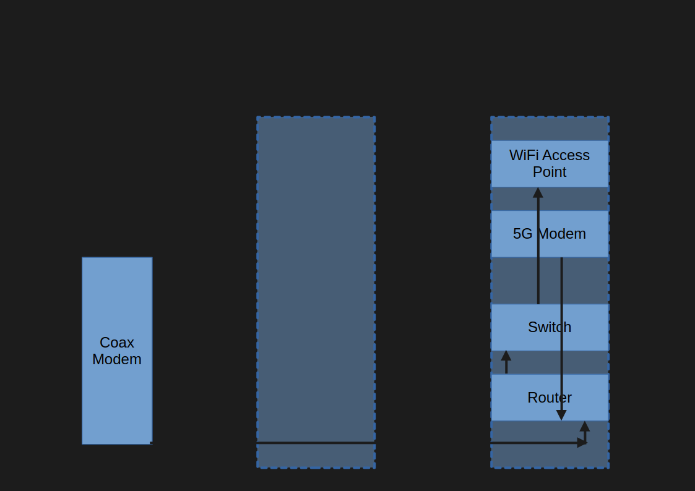

# paulrdelg.github.io

---

## Curriculum Vitae (CV)

### Academics

#### Junior/Community College

| instutition | Los Angeles Harbor College |
| degree | none |
| major | transferred |
| start | 2010 Summer |
| end | 2013 Spring |

#### Undergraduate

| instutition | University of Southern California |
| degree | Bachelor of Science |
| major | Electrical Engineering |
| start | 2013 Fall |
| end | 2016 Spring |

- (A-) Embedded Systems Design Laboratory (Capstone)
- (B+) Introduction to Communication Systems

#### Graduate

| instutition | Colorado State University |
| degree | Master of Science |
| major | Computer Engineering |
| start | 2018 Fall |
| end | 2022 Summer |
| minor | Computer Systems Engineering, Graduate Certificate |

coursework:

- (B+) Hardware/Software Design of Embedded Systems
- (A-) Embedded Systems and Machine Learning

#### Worcester Polytechnic Institute

| instutition | Worcester Polytechnic Institute |
| degree | Graduate Certificate |
| major | Engineering |
| start | 2025 Fall |
| end | 2022 Summer |

### Professional Experience

#### CMOS Digital Systems Engineer

| Company | Qorvo Incorporated |
| start | 2021 September |
| end | current |

- Generated mode table of several products for testbench simulation and verification modeling
- Scripted VBA macros for the customer from Register Map Details retaining single-source of truth
- Bore ownership revamping process software with best practices, transparency, and maintainability
- Automate manual processes with PowerShell scripting
- Review and fix mobile RF Front-End (RFFE) register map bitfield descriptions and mismatch from block diagrams

#### Circuit Design Engineer

| Company | Northrop Grumman Corporation |
| start | 2018 July |
| end | 2021 August |

- Responsible FPGA engineer for designs in several production systems specialized in Command and Data Handling
- Gathered System-level requirements, cross-referenced Board-level drawings, and amended Chip requirements
- Documented Chip Specification including design explanation, flow diagrams, and functional block illustrations
- Incorporated automatic bug ticketing system tool (SVN TRAC) to replace slow Excel file-sharing practices
- Automated design process for recreation of compilation (QuestaSim), synthesis (Synplify), and place-and-route
- Scripted generation of reports for linting, Questa Formal, clock-domain-crossing, and logic equivalency (OneSpin)
- Assisted Verification Engineer with coding test cases in standardized UVMF testbench
- Modelled system in software (ISO C++17) for vector matching of functional blocks using System Verilog DPI

#### Technical Services Engineer

| Company | Northrop Grumman Corporation |
| start | 2016 July |
| end | 2018 July |

- Supported Product Lifecycle Management (PLM) of various programs using Dassault ENOVIA web system
- Created custom reports with TCL scripting Matrix Query Language (MQL) custom-filtered commands
- Planned test matrices from Software Engineer’s concepts for successful Apps Engineer deployment

#### Summer Student Technician

| Company | Redondo Optics Incorporated |
| start | 2015 May |
| end | 2015 September |

- Debugged and repaired issues with circuit boards tested with a multimeter (short circuit test) to identify hardware failure

#### Computer Store Student Worker

| Company | University of Southern California Bookstore |
| start | 2013 |
| end | 2016 |

#### Math Tutor

| Company | Private |
| start | 2012 |
| end | 2013 |

### Certifications

#### 5G Introductory-Level Certificate

- Qualcomm Wireless Academy
- April 2025

#### Linux Essentials Certification

- Linux Professional Institute
- lpi.org/v/LPI000496684/6hg5ysv497
- August 2021

#### First Aid, CPR, AED Certification

- Red Cross
- October 2024

#### Mentor VHDL Introduction Certification

- Mentor, A Siemens Business
- November 02, 2018

### Awards

#### Naval Horizons Award

- Awarded: January 2021
  - Reported on the Department of Navy research submission reviewed by the American Society of Engineering (ASEE)

#### Bravo Award

- Awarded: October 10, 2018
  - Sole software support for a successful customer demo (Sagittarius) by filling the role on short notice (<30 days)
  - Programmed inherited C# software GUI application changes needed by hardware for the latest demo phase
  - Implemented requirement changes in real-time with multiple teams during integration and testing in a lab environment

#### Best Hardware Hackathon Award

- Awarded: May 2017
  - Tied for Best Use of IBM Bluemix & Watson Platform API Hack at SiliconHacks

#### Adobe Challenge Hackathon Award

- Awarded: April 2017
  - Led team using Android Firebase integration; taught teammates web programming at FresnoHacks

### Skills

#### Engineering Skills

- Hardware & Design: VHDL, Verilog
- Programming: C/C++ (tooling), Java, Python, MATLAB
- Tools & Platforms: Git (GitHub and Gitlab), Wireshark, AWS (S3, EC2, Route53), Lumerical (for silicon photonics)
- Networking Standards: Ethernet, HTTP/HTTPS, MIL-STD-1553

#### Other Skills

- English (native)
- Spanish (native)
- French (~B2/C1 level, TEF-IRN)
- Portuguese (~B1/B2 level)

---

## Projects

### Home Network Lab

#### Objective

- previous system was typical 19" server racks, which were too big and bulky for basic homelab needs
- power system needs to modular: all systems should take in DC power supplies inputs instead of AC-to-DC converters
- common power supplies with same voltage need to be unified to reduce number of total AC outlets
- power supplies should have uninterrupted power supplies

#### Solution

- systems sold include 4U server chasis, Uinterrupted Power Supplies

#### Current

